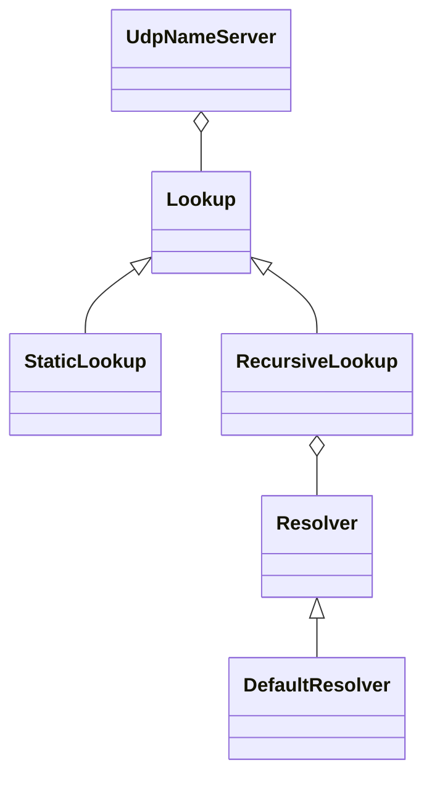

# Bighorn

A high-performance C++20 library for building DNS servers and tools, built upon Asio. See the `examples` folder for
example usages.

Dependencies:

* Asio
* GTest \[tests only]
* argparse \[examples only]

## Building

This project uses CMake and vcpkg as build tools. Install  [vcpkg](https://github.com/microsoft/vcpkg) and use it as
CMake's toolchain file. To build the test suite and example programs:

```
cmake -B build -S . -DCMAKE_TOOLCHAIN_FILE={vcpkg.cmake} && cmake --build build
```

Run the tests with `cd build && ctest`.

## Architecture


